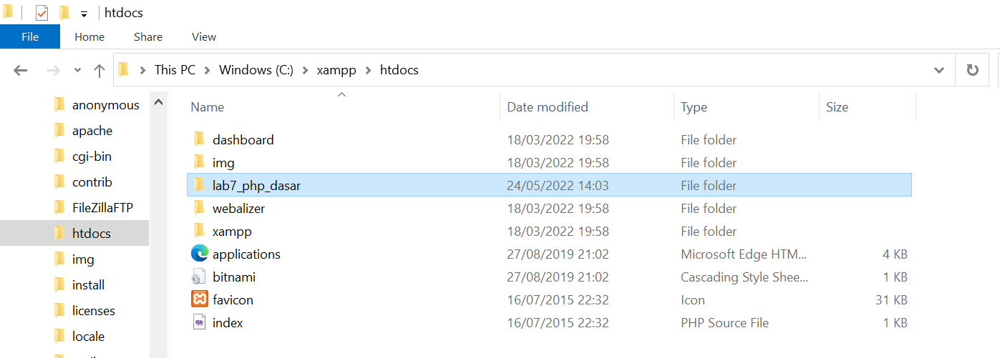
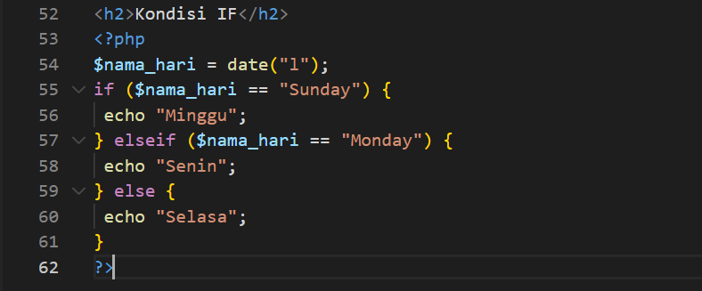
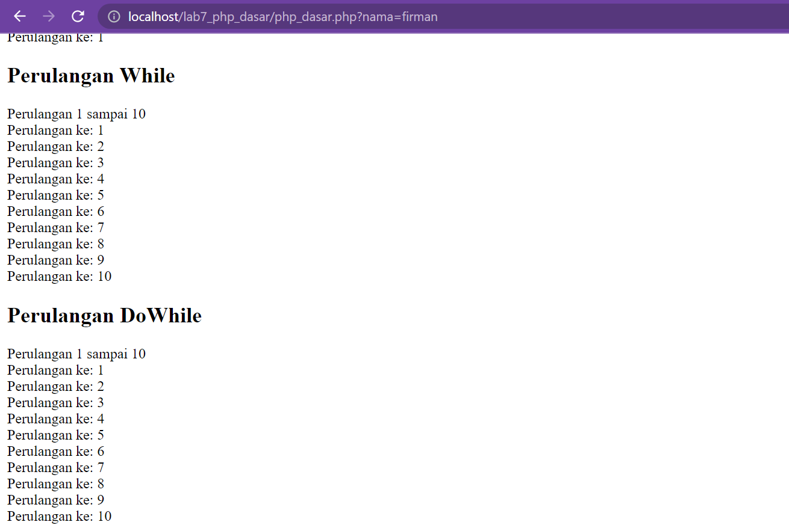
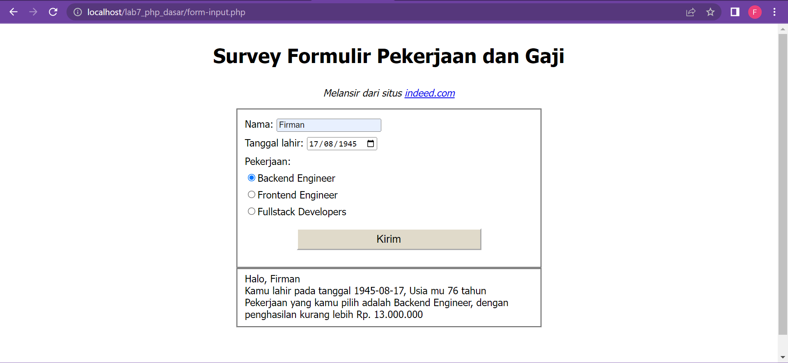

| Nama      | Firman Lintar Nurrohman |
| ----------- | ----------- |
| NIM     | 312010197       |
| Kelas   | TI.20.A.1        |

## Langkah langkah praktikum 7

## 1. Install XAMPP
Install XAMPP dari https://www.apachefriends.org/download.html

## 2. Menjalankan web server
Untuk menjalankan web server dari menu XAMPP Control

Menjalankan XAMPP dengan cara klik tombol Start pada server Apache seperti gambar diatas

## 3. Memulai PHP
Buat folder lab7_php_dasar pada root directory web server (\xampp\htdocs)

Kemudian untuk mengakses direktory tersebut pada web server dengan mengakses URL:
http://localhost/lab7_php_dasar/

## 4. PHP Dasar
Buat file baru dengan nama php_dasar.php pada directory tersebut. Kemudian buat
kode seperti berikut.

Berikut hasil run PHP Dasar

### Variable PHP
Menambahkan variable pada program.

### Predefine Variable `$_GET`

Untuk mengaksesnya gunakan URL:
http://localhost/lab7_php_dasar/php_dasar.php?nama=%firman

## 5. Membuat Form Input

### Operator

### Kondisi IF

### Kondisi Switch

### Perulangan for

### Perulangan while

### Perulangan do while

## Pertanyaan dan Tugas
Buatlah program PHP sederhana dengan menggunakan form input yang menampilkan
nama, tanggal lahir dan pekerjaan. Kemudian tampilkan outputnya dengan menghitung
umur berdasarkan inputan tanggal lahir. Dan pilihan pekerjaan dengan gaji yang
berbeda-beda sesuai pilihan pekerjaan.

## Jawab
1. Kode awal tanpa PHP

2. Kemudian tambahkan kode PHP

3. Setelah memilih Backend Engineer

4. Setelah memilih Frontend Engineer

5. Setelah memilih Fullstack Developer
